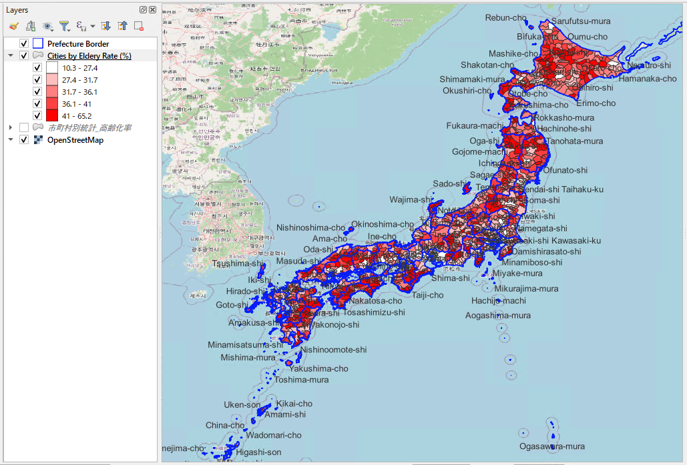
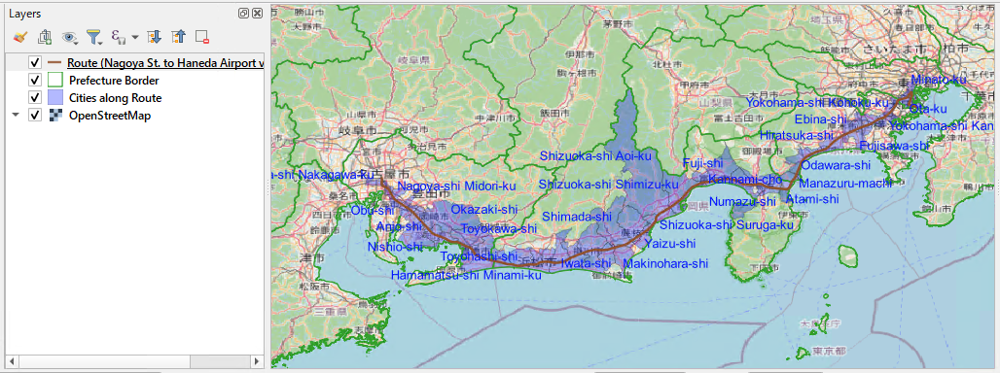

# GIS Trade Area Analysis

> Production-ready PostGIS SQL templates for spatial analysis and location intelligence in Japan.


---

## Overview

A collection of spatial SQL templates built on PostgreSQL + PostGIS, focused on Japanese administrative boundary and census data. Each template is designed for a real-world business scenario — retail site selection, delivery optimization, and demographic analysis — and can be run immediately by editing the `WITH params AS (...)` block at the top.

Census data covers **1,917 municipalities** across Japan (2015 & 2020, sourced from e-Stat). Administrative boundary geometries are sourced from the national land information portal (国土数値情報, MLIT).

---

## Sample Output


*Elderly rate by municipality (nationwide) — generated with [`sql/03_visualization/03-02_generate_choropleth_elderly_rate.sql`](sql/03_visualization/03-02_generate_choropleth_elderly_rate.sql) + QGIS*

---

## Use Cases

### 🏪 Trade Area Analysis
Aggregate population, elderly rate, household data, and population density within a given radius. The starting point for **retail site selection** and **franchise territory planning**.

### 👴 Demographic & Aging Analysis
Rank municipalities by elderly population rate with flexible region and population filters. Used for **healthcare facility planning** and **senior services market research**.

### 🚚 Delivery Area Assignment & Route Analysis
Assign municipalities to their nearest depot; calculate route length through each prefecture or municipality from waypoints or a GPS log table. Built for **delivery network design** and **vehicle routing analysis**.


*Municipalities intersected by a route from Nagoya Station to Haneda Airport — generated with [`sql/02_analysis/02-05c_list_cities_along_route_from_gps_log.sql`](sql/02_analysis/02-05c_list_cities_along_route_from_gps_log.sql) + QGIS*

### 📦 Customer Distribution & Territory Design
Geocode customer records to municipality level, calculate penetration rates against census population, and flag data quality issues (missing IDs, out-of-range coordinates, duplicates). Supports **sales territory design** and **marketing area reporting**.

---

## SQL Templates

**15 production-ready templates** across 3 categories. All follow the same pattern — edit the params block, run the file.

| Category | Count | Description |
|----------|-------|-------------|
| [`sql/01_basic/`](sql/01_basic/) | 3 | Reverse geocoding, prefecture lookup, straight-line distance |
| [`sql/02_analysis/`](sql/02_analysis/) | 8 | Trade area population, customer aggregation, delivery assignment, route analysis, demographic ranking |
| [`sql/03_visualization/`](sql/03_visualization/) | 1 | Municipality polygon output with demographic breakdown for QGIS choropleth |

→ **[Full template index with code examples and output descriptions](sql/README.md)**

---

## Quick Start

### Prerequisites

- PostgreSQL 12+ with PostGIS 3.0+
- Administrative boundary data loaded into `admin_jp` schema
- Census data loaded into `e_stat` schema

See [Data Sources](#data-sources) below for download links. For census schema design and step-by-step ingestion instructions, see [`docs/census_jp_README.md`](docs/census_jp_README.md).

### 1. Enable PostGIS

```sql
CREATE EXTENSION IF NOT EXISTS postgis;
```

### 2. Run your first query

Open any template, edit the coordinates in the `params` block, and run:

```bash
# Reverse-geocode a coordinate to municipality
psql -d your_database -f sql/01_basic/01-01_find_city_from_point.sql

# Trade area population within 30 km of Nagoya Station
psql -d your_database -f sql/02_analysis/02-01_calc_trade_area_population.sql
```

---

## Data Sources

| Dataset | Provider | License | Notes |
|---------|----------|---------|-------|
| Administrative boundaries (市区町村・都道府県) | [国土数値情報, MLIT](https://nlftp.mlit.go.jp/ksj/) | Free, attribution required | 2023 edition, 1,917 municipalities |
| Census — population & employment (国勢調査) | [e-Stat, Statistics Bureau of Japan](https://www.e-stat.go.jp/) | Free, attribution required | 2015 & 2020 |
| Road network | [OpenStreetMap](https://www.openstreetmap.org/) | ODbL — attribution required | Major roads materialized view |

> For census schema design, table definitions, and full ingestion documentation, see [`docs/census_jp_README.md`](docs/census_jp_README.md).

---

## Repository Layout

```
gis-trade-area-analysis/
├── sql/                  # SQL templates
│   ├── README.md         # Full template index with code examples
│   ├── 01_basic/         # Foundational spatial operations (3 templates)
│   ├── 02_analysis/      # Core spatial analysis (8 templates)
│   └── 03_visualization/ # QGIS / map output queries (1 template)
├── data/                 # Sample CSV data for testing templates
├── output/               # Map output examples (QGIS screenshots)
├── docs/                 # Extended documentation
│   └── census_jp_README.md  # Census data schema & ingestion design
└── python/               # Python tools (coming soon)
```

---

## Attribution

Data used in this repository is sourced from:

- **国土数値情報 (MLIT)** — Administrative boundary data. Free for commercial use with attribution. [Terms](https://nlftp.mlit.go.jp/ksj/other/agreement.html)
- **e-Stat, Statistics Bureau of Japan** — Census data (国勢調査). Free for commercial use with attribution. [Terms](https://www.e-stat.go.jp/terms-of-use)
- **OpenStreetMap contributors** — Road network data. © OpenStreetMap contributors, ODbL. [Terms](https://www.openstreetmap.org/copyright)
