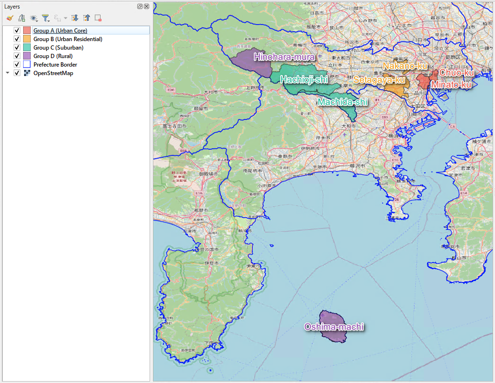
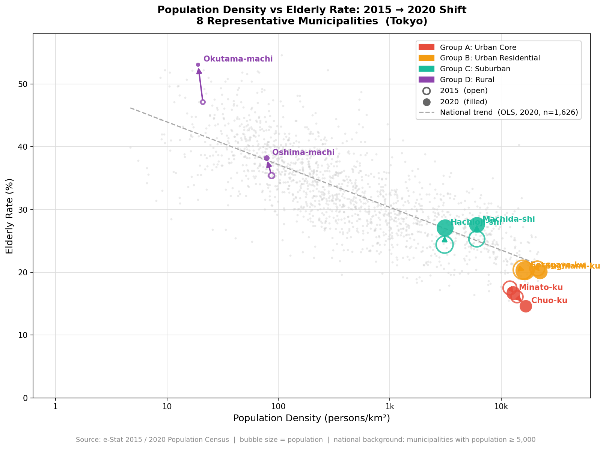
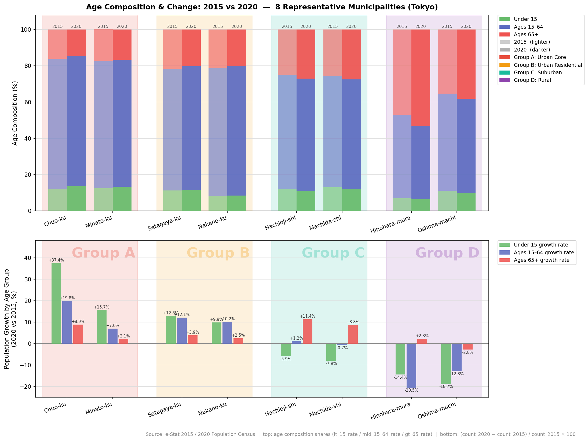

# Urban Aging Dynamics: Density × Elderly Rate Shift Analysis (2015–2020)
**Eight Representative Municipalities — Tokyo Metropolitan Area**

---

## 1. Key Findings

| Group | Urban Type | 2015 → 2020 Movement | Hypothesis Match |
|---|---|---|---|
| A | Urban Core | Denser + Younger | ✅ Confirmed |
| B | Urban Residential | Stable density + Elderly rate flat / slightly lower | ⚠️ Aging slower than expected |
| C | Suburban | Stable density + Older | ✅ Confirmed |
| D | Rural | Less dense + Older | ✅ Confirmed |

Three of the four groups moved as hypothesised.
Group B aged more slowly than expected — a finding that itself carries important implications
(see §5).

---

## 2. Background

Japan faces one of the most acute demographic transitions in the developed world,
but the trajectory differs sharply by urban type.
City centres are being repopulated by high-income young professionals;
inner suburbs are aging quietly; peripheral areas face accelerating depopulation.

Understanding **which areas are moving in which direction — and at what speed** —
is essential for:

- **Site selection** (retail, healthcare, elder-care facilities)
- **Infrastructure investment prioritisation**
- **Local government fiscal planning**

This analysis uses the national scatter plot of population density vs. elderly rate
as a diagnostic lens, tracking how eight representative Tokyo municipalities
moved across that space between the 2015 and 2020 censuses.

---

## 3. Data & Methodology

| Item | Detail |
|---|---|
| Data source | e-Stat 2015 & 2020 Population Census (`e_stat.census_population`) |
| Coverage | All Japanese municipalities with population ≥ 5,000 (~1,600 cities) |
| Spotlight | 8 municipalities selected across 4 urban-type groups (2 per group) |
| X axis | Population density (persons/km², log scale) |
| Y axis | Elderly rate — share of population aged 65+ (%) |
| Arrows | Each arrow connects the 2015 point (open circle) to the 2020 point (filled circle) |
| Bubble size | Population at each year |
| Reference line | National OLS trend fitted to all 2020 municipalities |

**Script:** [`python/01_data_analytics/01-03_profile_representative_cities.py`](../../python/01_data_analytics/01-03_profile_representative_cities.py)

---

## 4. Spatial Overview

*8 representative municipalities colour-coded by urban-type group — visualised in QGIS with OpenStreetMap base layer.*

The eight municipalities span the full density spectrum of the Tokyo Metropolitan area:
from the hyper-dense central wards (Chuo-ku: ~11,000 persons/km²)
to a remote volcanic island (Oshima-machi: ~125 persons/km²).
This range ensures that each group represents a genuinely distinct urban environment,
not a subtle statistical distinction.

| Group | Municipality | Urban character |
|---|---|---|
| A – Urban Core | Chuo-ku | Central business/residential district; tower condominiums |
| A – Urban Core | Minato-ku | Embassies, corporate HQs, luxury residential |
| B – Urban Residential | Setagaya-ku | Largest ward by population; established low-rise residential |
| B – Urban Residential | Nakano-ku | Dense urban residential; major commuter hub and shopping district |
| C – Suburban | Hachioji-shi | Western Tokyo suburb; university town |
| C – Suburban | Machida-shi | Southern Tokyo suburb; commercial corridor |
| D – Rural | Hinohara-mura | Tokyo's only village; mountainous, small population, high elderly rate |
| D – Rural | Oshima-machi | Volcanic island; isolated, small population base |

---

## 5. Hypothesis & Verification

### Hypothesis

Based on known patterns of urban demographic change in Japan,
we expected the following 2015 → 2020 movements on the density × elderly rate plot:

- **Group A (Urban Core):** Rightward and downward.
  Continued in-migration of young, high-income professionals —
  driven by tower condominium development — would push density higher
  while the elderly share falls.

- **Group B (Urban Residential):** Upward (small vertical shift).
  Established residential neighbourhoods would see minimal new in-migration
  but steady aging as long-term residents grow older in place.

- **Group C (Suburban):** Upward (moderate vertical shift).
  The original suburban cohort — families who moved in during Japan's
  high-growth era (1960s–80s) — would age in place as their children move away,
  raising the elderly share without significant density change.

- **Group D (Rural):** Leftward and upward.
  Continued out-migration of working-age residents would simultaneously
  reduce density and accelerate the elderly share.

If these four trends play out simultaneously across all municipalities,
the national scatter plot will evolve in a characteristic way:
the distribution will stretch further along the OLS trend axis (upper-left and lower-right),
while the middle range of moderate-density municipalities bulges upward —
producing the arch-shaped pattern already visible in regional panels.

### Results

*Arrows connect 2015 (open circle) to 2020 (filled circle).
Bubble size = population.
Dashed line = national OLS trend (2020).*

---

**Group A – Urban Core: ✅ Confirmed**

Both Chuo-ku and Minato-ku shifted rightward and downward —
higher density, lower elderly rate.
This is consistent with the well-documented "power couple" in-migration
to newly built tower condominiums in central Tokyo,
where high living costs create a self-selecting, young, high-income resident base.
Elderly residents who cannot sustain the cost of living appear to be relocating
to less expensive surrounding areas.

---

**Group B – Urban Residential: ⚠️ Aging Slower Than Expected**

Setagaya-ku and Nakano-ku remained almost exactly in place —
density changed little and the elderly rate was essentially flat,
or showed a marginal decline rather than the increase we predicted.

This is a more optimistic outcome than hypothesised.
A plausible explanation:
the relatively high property values and strong residential reputation
of inner-city wards like Setagaya and Nakano continue to attract
younger, higher-income households, enough to partially offset
the natural aging of the existing resident base.
Unlike the dramatic rejuvenation driven by tower-condominium development
in Group A, the effect here is subtle — a gentle counterbalance
rather than a structural shift.

Whether this stability persists into the next decade depends on
whether younger in-migration can be sustained as Group A central wards
continue to absorb demand. If the competitive advantage of these
inner wards weakens, the trajectory may shift toward the Group C pattern.

---

**Group C – Suburban: ✅ Confirmed**

Hachioji-shi and Machida-shi aged as predicted, with minimal density change.
The housing stock in these cities was largely built between the 1960s and 1990s
to accommodate Tokyo's expanding workforce.
That cohort is now retiring, and the children who grew up in these suburbs
have predominantly moved closer to employment centres.
The demographic echo of the high-growth era is arriving on schedule.

---

**Group D – Rural: ✅ Confirmed**

Hinohara-mura and Oshima-machi moved leftward and upward —
falling density and rising elderly share.
The arrow length for Hinohara-mura is particularly striking:
as Tokyo's only village, its population base is already extremely small,
so even a modest absolute out-migration produces a large shift in elderly share.
This amplification effect means that small rural municipalities
can deteriorate rapidly once a threshold of depopulation is crossed.

---

## 5.1 Age Composition & Population Growth by Age Group

The scatter-shift plot shows *where* each municipality moved on the density × elderly-rate plane,
but it does not reveal *why* the elderly rate rose or fell.
The following figure disaggregates that movement into age-group composition and absolute growth rates.

*Top: age composition shares (Under 15 / Ages 15–64 / Ages 65+) for 2015 (lighter) and 2020 (darker).
Bottom: population growth rate within each age group between 2015 and 2020
((count₂₀₂₀ − count₂₀₁₅) / count₂₀₁₅ × 100).*

---

**Group A — "All layers grew; youth grew fastest"**

The key insight for Group A is visible in the bottom panel:
every age group increased in absolute numbers, but the Under-15 cohort grew at a dramatically
higher rate than the others (Chuo-ku: **+37.4 %**, Minato-ku: **+15.7 %**).
Because the composition denominator (total population) expanded fastest through young-layer growth,
the elderly *share* fell even though the absolute number of residents aged 65+ also increased.
This is the defining mechanism of the "power couple / tower condominium" demographic dynamic.

**Group B — Composition broadly stable**

Setagaya-ku and Nakano-ku show modest positive growth across all age groups,
with no single layer dramatically outpacing the others.
This confirms the scatter-shift observation: gentle equilibrium rather than structural rejuvenation.

**Group C — Working-age growth offsets aging, but narrowly**

Hachioji-shi and Machida-shi show moderate growth in the working-age cohort
but a small decline or near-stagnation in Under-15 population.
Without a sustained influx of young families, the suburban aging trajectory
is expected to reassert itself over the next decade.

**Group D — Absolute population loss across all cohorts**

Hinohara-mura and Oshima-machi show negative growth rates across all three age groups.
The working-age decline is the steepest (Hinohara-mura: **−20.5 %**),
which both reduces density and, by shrinking the denominator, mechanically raises the elderly share —
a compounding effect that accelerates apparent aging beyond what actual elder population change implies.

---

## 6. Implications

### Immediate concerns — Group D

Rural municipalities with elderly rates already above 50%
are under immediate pressure across multiple dimensions:
emergency medical response times, daily shopping access (food deserts),
public transport viability, and the ability to staff municipal services at all.
The challenge is no longer prevention but managed decline.

### Medium-term fiscal risk — Group C

Suburban municipalities are not yet in crisis,
but the directional movement is unambiguous.
As the current working-age cohort retires over the next 10–15 years,
the productive tax base will shrink even while demand for social services rises.
Municipalities in this group have a narrowing window
to restructure land use, attract younger residents, or consolidate services
before the fiscal position becomes structurally impaired.

### Watch point — Group B

The current stability of inner-suburban municipalities is more resilient
than expected, but it is not guaranteed.
If young in-migration to Group B weakens — for example,
as Group A central wards continue to expand condominium supply and absorb demand —
the gentle equilibrium could tip toward the Group C pattern
with relatively little warning.
Group B warrants monitoring in the 2025 census data.

### Location analytics implications

| Sector | Group A | Group B | Group C | Group D |
|---|---|---|---|---|
| Retail | Premium / lifestyle | Mid-market consolidation | Convenience-led | Delivery & mobile service |
| Healthcare | Preventive / sports | Chronic disease management | Elder care ramp-up | Crisis-level demand now |
| Real estate | Investment grade | Watch closely | Value caution | Asset impairment risk |
| Public services | Revenue surplus | Stable (short term) | Fiscal stress incoming | Fiscal crisis |

---

## 7. Further Analysis

This initial scatter-shift visualisation raises several questions for deeper investigation:

- **Data-driven clustering (script `01-04`):**
  Can an unsupervised algorithm (GMM / K-means) reproduce and refine
  these four groups across all ~1,600 Japanese municipalities,
  validating that the hand-selected eight are genuinely representative?

- **Cluster-level trend analysis (script `01-05`):**
  Do the 2015 → 2020 directional patterns observed for Tokyo hold
  at the national level, or are they specific to the Tokyo Metropolitan context?

- **Employment structure:**
  Does the ratio of employed-to-resident population explain
  the unexpected Group B behaviour?
  (`e_stat.census_employment` — to be analysed)

- **Fiscal data integration:**
  Can the aging trajectory be correlated with changes in
  municipal tax revenue or social welfare expenditure?
  (Requires external fiscal dataset linkage)

---

*Data: e-Stat 2015 & 2020 Population Census |
Scripts: [`01-03`](../../python/01_data_analytics/01-03_profile_representative_cities.py),
[`01-04`](../../python/01_data_analytics/01-04_cluster_municipalities_by_density_aging.py) |
See also: [Python README](../../python/README.md)*
