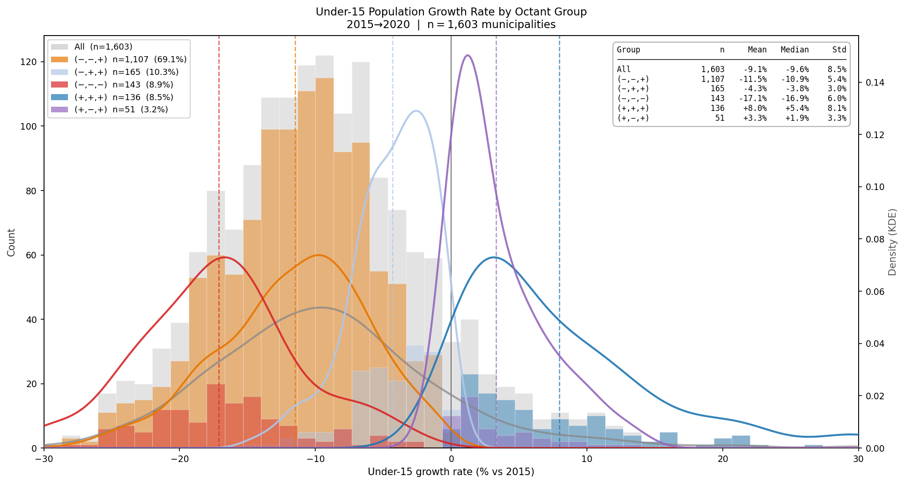
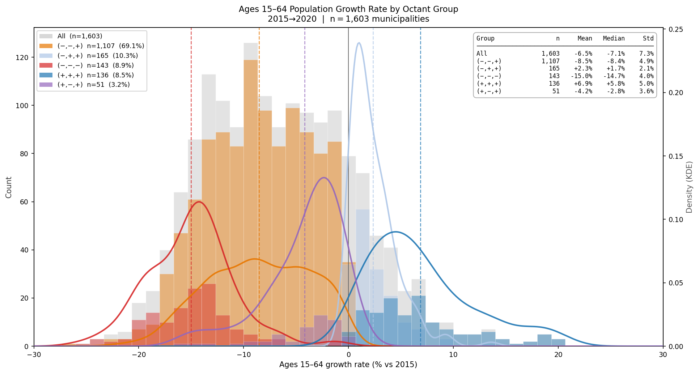
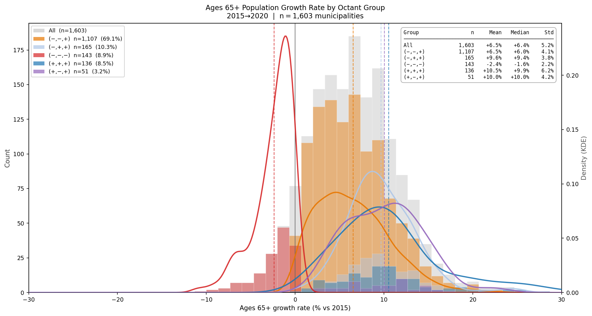
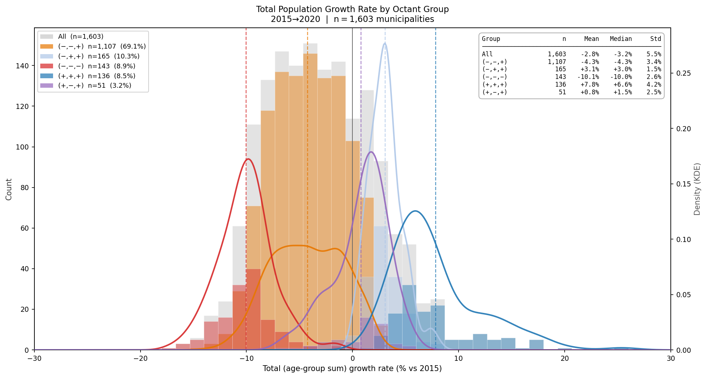

# Octant Group Growth Rate Distributions (2015–2020)
**Histogram Analysis — Five Major Demographic Trajectory Types**

---

## 1. Background — Octant Classification

This document is a detailed follow-up to **§7 of the
[Nationwide Aging Dynamics analysis](01-05_nationwide_aging_dynamics.md)**,
which introduced the octant framework:
each municipality is classified by the sign (+ or −) of its three age-group
growth rates, yielding eight possible trajectory types.

The bar chart below reproduces that classification for reference.

*n = 1,603 municipalities (2020 population ≥ 5,000).
Each bar represents one of eight possible (+/−) sign combinations of
Under-15, Ages 15–64, and Ages 65+ growth rates (2015→2020).*

This document focuses on the **five groups with n ≥ 50** — the threshold
below which histogram shape becomes statistically unstable:

| Pattern (Under-15, 15–64, 65+) | n | Share | Demographic interpretation |
|---|---|---|---|
| **(−, −, +)** | **1,107** | **69.1 %** | Sequential depopulation — working-age and children declining, 65+ still growing |
| (−, +, +) | 165 | 10.3 % | Labour in-migration without family formation |
| (−, −, −) | 143 | 8.9 % | Advanced depopulation — all cohorts declining |
| (+, +, +) | 136 | 8.5 % | All cohorts growing — urban cores and fast-growing suburbs |
| (+, −, +) | 51 | 3.2 % | Under-15 marginally growing, Ages 15–64 declining |

---

## 2. Histograms — Growth Rate Distribution by Octant Group

**Scripts & Outputs:**

| File | Description |
|---|---|
| [`python/01_data_analytics/01-06_age_growth_correlation.py`](../../python/01_data_analytics/01-06_age_growth_correlation.py) | Octant classification |
| [`python/01_data_analytics/01-07_octant_growth_distributions.py`](../../python/01_data_analytics/01-07_octant_growth_distributions.py) | Histogram generation |

Each panel shares the following design:

- **Gray bars + gray KDE curve** — all 1,603 municipalities (left axis: count; right axis: density)
- **Coloured bars + coloured KDE curves** — each of the five octant groups
- **Dashed vertical lines** — group mean per octant colour
- **X-axis unified at −30 % to +30 %** across all four panels for vertical alignment

---

### Under-15 Growth Rate

The (−, −, +) amber curve closely tracks the full-dataset gray curve, reflecting
its 69.1 % share of all municipalities.
The (+, +, +) blue group is the only one clearly separated to the right,
confirming that genuine child-population growth is concentrated in
urban-core and fast-growing suburban municipalities.

---

### Ages 15–64 Growth Rate

The (−, +, +) light-blue group is the **only group whose KDE curve peaks
in positive territory**, directly distinguishing it from all other groups.
This separation is the clearest visual confirmation that labour in-migration
without family formation operates through a different mechanism from
standard household co-migration.

---

### Ages 65+ Growth Rate

Four of the five groups cluster in positive territory.
The sole exception — the (−, −, −) red group — peaks just below zero (around −2 %),
with a notably narrow spread.
All other groups show positive 65+ growth, distributed between roughly
+2 % and +15 %.

---

### Total (Age-Group Sum) Growth Rate

Even in the dominant (−, −, +) group, the total growth rate averages
around −4 %, confirming that the positive 65+ trend does not fully offset
losses in younger cohorts.
The (+, +, +) group peaks to the right of zero;
the (−, −, −) group anchors the far left.

---

## 3. Key Observations

### Observation 1 — (−, −, +) and full-dataset distributions are nearly identical in shape

The (−, −, +) KDE tracks the "All" curve closely in the Under-15 and
Ages 15–64 panels.
This is expected: at 69.1 % of all municipalities, the dominant group
necessarily shapes the aggregate.

The most informative divergence appears in the **Ages 65+ panel**,
where the "All" curve develops a left tail absent from (−, −, +).
That tail is contributed by the (−, −, −) group — the only group whose
65+ cohort is in negative territory —
and represents the 143 municipalities at the advanced stage of depopulation.

### Observation 2 — Broad, flat KDE peaks indicate heterogeneous decline rates within (−, −, +)

Rather than a single sharp peak, the (−, −, +) distributions for Under-15
and Ages 15–64 show a broad, flat-topped profile.
This reflects the reality that the "sequential depopulation" category
encompasses municipalities at very different stages:
mild suburban decline (growth rates close to zero) coexists with
accelerating rural depopulation (rates in the −20 % to −30 % range),
with no single rate dominating.
The category label is the same, but the pace of change varies widely
across the 1,107 municipalities within it.

### Observation 3 — (−, −, −) group shows only marginal 65+ decline

In the Ages 65+ panel, the red KDE curve peaks around −2 % with a
narrow spread — the tightest distribution of any group in that panel.
Even in the 143 municipalities where all three cohorts are declining,
the elderly cohort has barely crossed into negative territory.

This directly confirms the sequential depopulation model introduced in
[01-05 §6](01-05_nationwide_aging_dynamics.md#6-finding-2--ages-65-growth-is-largely-independent-and-mostly-positive):
the 65+ cohort is structurally the last to turn negative,
and even at the most advanced stage of depopulation it declines only modestly.

### Observation 4 — (+, −, +) group shows only marginal Under-15 growth

In the Under-15 panel, the purple KDE curve for the (+, −, +) group
peaks around +1 %, with a narrow spread just above zero.
These 51 municipalities technically register positive Under-15 growth,
but only marginally.

This borderline positioning is consistent with their structural profile:
labour in-migration into logistics hubs, industrial zones, or care-sector
employers creates minimal Under-15 growth without the sustained family
formation that would push rates meaningfully higher.
Statistically, this group sits at the threshold between (−, −, +)
and a genuinely child-growing trajectory.

---

*Data: e-Stat 2015 & 2020 Population Census |
Scripts: [`01-06`](../../python/01_data_analytics/01-06_age_growth_correlation.py),
[`01-07`](../../python/01_data_analytics/01-07_octant_growth_distributions.py) |
See also: [Nationwide Aging Dynamics (01-05)](01-05_nationwide_aging_dynamics.md)*
