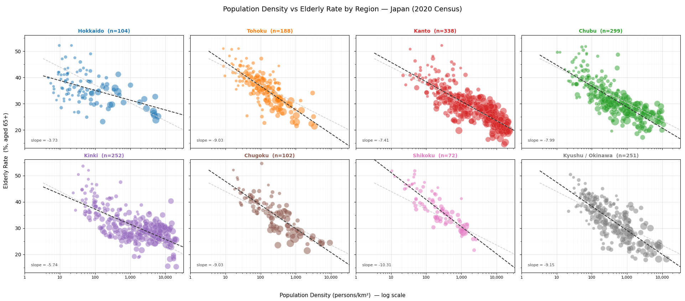
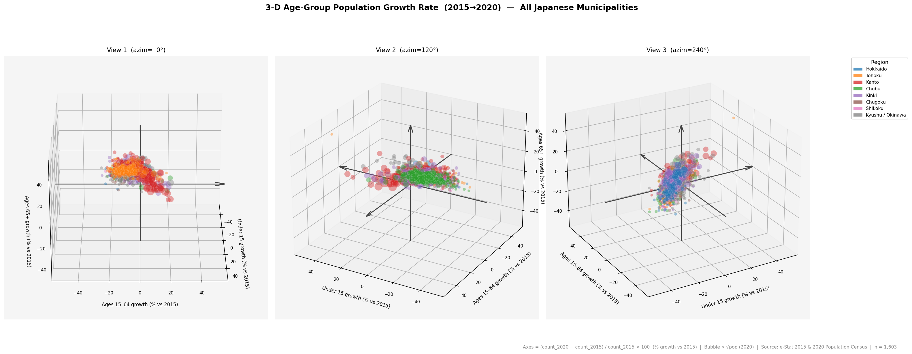
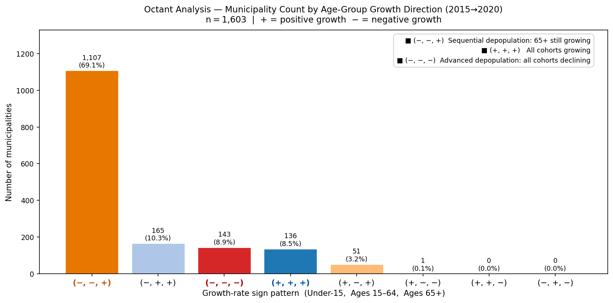
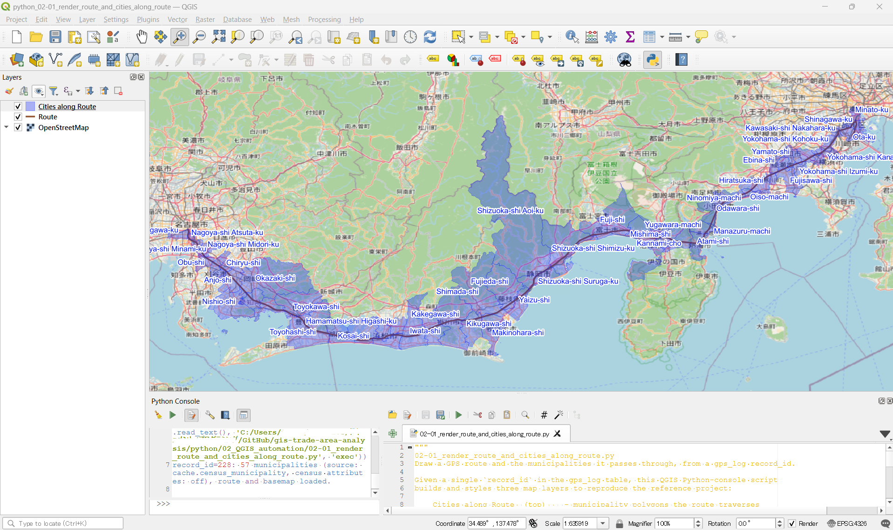

# Python Tools

Python tools for GIS data processing, spatial analysis, and visualization. Complements the PostGIS SQL templates in [`sql/`](../sql/).

> **Execution environments:** Scripts in `01_data_analytics`, `03_data_cleansing`, and `04_data_conversion` are designed for standard Python environments (PyCharm, VS Code, etc.). Scripts in `02_QGIS_automation` are designed to run in the QGIS Python console. The `99_snippets/gis_utils` package can be imported into any Python project.

---

## Folder Index

| Folder | Purpose | Environment |
|--------|---------|-------------|
| [00_notebooks/](00_notebooks/) | Jupyter Notebook showcase — analysis walkthroughs with inline output | Jupyter |
| [01_data_analytics/](01_data_analytics/) | Distribution analysis, regression, non-spatial visualization (pandas, numpy, matplotlib) | Python / PyCharm |
| [02_QGIS_automation/](02_QGIS_automation/) | Multi-layer map automation via QGIS Python console | QGIS only |
| [03_data_cleansing/](03_data_cleansing/) | Data quality checks and cleanup — null coordinates, encoding errors, duplicate records | Python / PyCharm |
| [04_data_conversion/](04_data_conversion/) | Format conversion between CSV, Excel, GeoJSON, Shapefile, and others | Python / PyCharm |
| [99_snippets/gis_utils/](99_snippets/gis_utils/) | Importable utility library for coordinate and mesh code operations | Any Python project |

---

## 01_data_analytics — Scripts

Statistical analysis and non-spatial visualization using pandas, numpy, and matplotlib.
Reads data from PostgreSQL via psycopg2. Credentials loaded from `AccessKeys/my_access.py`.

| File | Purpose | Output | Analysis |
|------|---------|--------|----------|
| [01-01_scatter_density_vs_elderly_rate.py](01_data_analytics/01-01_scatter_density_vs_elderly_rate.py) | Bubble scatter: population density vs elderly rate, colored by region, outlier-labeled | [PNG](../output/python/01-01_scatter_density_vs_elderly_rate.png) | — |
| [01-02_scatter_density_vs_elderly_rate_by_region.py](01_data_analytics/01-02_scatter_density_vs_elderly_rate_by_region.py) | 8-panel version of 01-01: one subplot per region, regional vs national OLS trend comparison | [PNG](../output/python/01-02_scatter_density_vs_elderly_rate_by_region.png) | — |
| [01-03_profile_representative_cities.py](01_data_analytics/01-03_profile_representative_cities.py) | Shift-arrow scatter for 8 representative municipalities across 4 urban-type groups — population density × elderly rate, 2015 → 2020 | [PNG](../output/python/01-03_scatter_shift.png) | [Urban Aging Dynamics](../docs/analysis/01-03_urban_aging_dynamics.md) |
| [01-04_cluster_municipalities_by_density_aging.py](01_data_analytics/01-04_cluster_municipalities_by_density_aging.py) | GMM clustering of ~1,900 municipalities into 6 urban-type groups by density and elderly rate; K-means comparison; BIC model selection | [PNG](../output/python/01-04_cluster_municipalities_by_density_aging.png), CSV | [Urban Aging Dynamics](../docs/analysis/01-03_urban_aging_dynamics.md) |
| [01-05_3d_age_composition_scatter.py](01_data_analytics/01-05_3d_age_composition_scatter.py) | 3-D scatter of age-cohort growth rates (Under-15 / Ages 15–64 / Ages 65+) for all ~1,700 municipalities; static 3-panel PNG and interactive HTML | [PNG](../output/python/01-05_3d_age_static.png), [HTML](../output/python/01-05_3d_age_interactive.html), angle PNGs | [Nationwide Aging Dynamics](../docs/analysis/01-05_nationwide_aging_dynamics.md) |
| [01-06_age_growth_correlation.py](01_data_analytics/01-06_age_growth_correlation.py) | Octant classification by sign of three age-group growth rates; bar chart of municipality counts by demographic trajectory type | [PNG](../output/python/01-06_octant_analysis.png) | [Nationwide Aging Dynamics §7](../docs/analysis/01-05_nationwide_aging_dynamics.md#7-octant-analysis--quantifying-the-directional-pattern) |
| [01-07_octant_growth_distributions.py](01_data_analytics/01-07_octant_growth_distributions.py) | Growth rate histograms for 5 major octant groups vs full dataset; dual Y-axis (count + KDE); 4 separate panels by age group | 4 × [PNG](../output/python/) | [Octant Group Growth Rate Distributions](../docs/analysis/01-07_octant_histogram_analysis.md) |


*Population density vs elderly rate by municipality (2020 Census) — bubble size = population, color = region, dashed line = OLS trend*


*8-panel view by region — dark dashed = regional trend, gray dashed = national trend (reference)*


*3-D scatter of 2015→2020 growth rates for Under-15 / Ages 15–64 / Ages 65+ across ~1,700 municipalities — three fixed viewpoints at azimuth 0° / 120° / 240°*


*Municipality counts by age-group growth direction (octant) — n = 1,603 municipalities (2020 population ≥ 5,000)*

---

## 02_QGIS_automation — Scripts

Multi-layer map automation for the **QGIS Python console** (PyQGIS + `iface`).
These scripts are not standalone — run them from *Plugins > Python Console*.
Database access uses a saved QGIS PostgreSQL connection by name, so no credentials
are stored in the files.

| File | Purpose | Layers produced | Companion SQL |
|------|---------|-----------------|---------------|
| [02-01_render_route_and_cities_along_route.py](02_QGIS_automation/02-01_render_route_and_cities_along_route.py) | Draw and style a GPS route plus the municipalities it passes through. Prompts at run time for the `gps_log.record_id`, the label language, and whether to attach census attributes — so records can be redrawn without editing the file | Cities along Route (polygons) · Route (line) · OpenStreetMap (basemap) | [03-04](../sql/03_visualization/03-04_visualize_cities_along_route_from_gps_log.sql) |

**02-01 at a glance**

- **Run-time prompts** (Qt dialogs, no file edits needed): `record_id` · label language
  `en`/`jp` · include census attributes `yes`/`no`.
- **Language switch** drives the label column, the label font, and the layer names
  together, so `jp` yields 「ルート沿い市区町村」/「ルート」 with Japanese names.
- **Census option** — answer `yes` to carry every census column on the municipality
  layer, so clicking a polygon shows its demographic profile (population, elderly
  rate, density, industry, …) in the Identify panel. Identity and route-metric
  columns always lead the attribute order.
- **Municipality source is auto-resolved:** a local materialized copy is preferred and
  the FDW view is used as a fallback, so the script is fast where the local cache
  exists and still runs on a plain `postgres_fdw` setup.

> **Prerequisites for 02-01:** a saved QGIS PostgreSQL connection to the gps_log
> database (default name `GPS_log`), and `postgres_fdw` configured so that
> `public.v_census_municipality` is reachable as a foreign table. Querying that FDW
> view directly is slow on long routes (the remote re-runs its census joins on every
> call); building a local materialized copy once — see the setup block in the script
> docstring — is picked up automatically and cuts a render to about a second.


*One run of 02-01 from the QGIS Python console — a GPS route (Nagoya → Tokyo) with the 57 municipalities it passes through, styled and labelled automatically over an OpenStreetMap basemap*

---

## 99_snippets/gis_utils — Utility Library

An importable Python package for common GIS coordinate operations in Japan.

### Installation

No installation required — add `99_snippets/` to your Python path:

```python
import sys
sys.path.insert(0, 'path/to/python/99_snippets')
from gis_utils import to_mesh2, to_mesh3, dms_to_dd, wgs84_to_jpr
```

> **Optional dependency:** `jpr.py` (Japan Plane Rectangular conversion) requires [pyproj](https://pypi.org/project/pyproj/): `pip install pyproj`. All other modules have no external dependencies.

### Function Index

#### mesh_code.py — JIS X 0410 Mesh Code (Japan Standard Statistical Grid)

| Function | Input | Output | Description |
|----------|-------|--------|-------------|
| `to_mesh2(lat, lon)` | decimal degrees | `str` (6 digits) | Coordinate → secondary mesh code (~10 km grid) |
| `to_mesh3(lat, lon)` | decimal degrees | `str` (8 digits) | Coordinate → tertiary mesh code (~1 km grid) |
| `mesh2_to_bbox(code)` | 6-digit code | `dict` | Secondary mesh → bounding box (lat/lon min/max) |
| `mesh2_to_center(code)` | 6-digit code | `(lat, lon)` | Secondary mesh → center coordinate |
| `mesh3_to_bbox(code)` | 8-digit code | `dict` | Tertiary mesh → bounding box |
| `mesh3_to_center(code)` | 8-digit code | `(lat, lon)` | Tertiary mesh → center coordinate |

```python
from gis_utils import to_mesh2, to_mesh3, mesh2_to_center

to_mesh2(35.68, 139.77)          # → '533946'   (central Tokyo, ~10 km grid)
to_mesh3(35.68, 139.77)          # → '53394611' (~1 km grid)
mesh2_to_center('533946')        # → (35.708, 139.8125)
```

#### dms.py — Degrees-Minutes-Seconds ↔ Decimal Degrees

| Function | Input | Output | Description |
|----------|-------|--------|-------------|
| `dms_to_dd(deg, min, sec, direction)` | DMS + N/S/E/W | `float` | DMS → decimal degrees |
| `dd_to_dms(dd, axis)` | decimal degrees | `(deg, min, sec, direction)` | Decimal degrees → DMS |

```python
from gis_utils import dms_to_dd, dd_to_dms

dms_to_dd(35, 40, 48, 'N')       # → 35.68
dd_to_dms(139.77, axis='lon')    # → (139, 46, 12.0, 'E')
```

#### jpr.py — WGS84 ↔ Japan Plane Rectangular Coordinate System *(requires pyproj)*

| Function | Input | Output | Description |
|----------|-------|--------|-------------|
| `wgs84_to_jpr(lat, lon, zone)` | decimal degrees + zone (1-19) | `(X, Y)` metres | WGS84 → JPR (X=northing, Y=easting) |
| `jpr_to_wgs84(x, y, zone)` | metres + zone | `(lat, lon)` | JPR → WGS84 |
| `get_zone(prefecture)` | prefecture name (kanji or romaji) | `int` (1-19) | Prefecture → recommended zone number |

```python
from gis_utils import wgs84_to_jpr, jpr_to_wgs84, get_zone

get_zone('東京')                          # → 9
get_zone('osaka')                         # → 6
x, y = wgs84_to_jpr(35.6812, 139.7671, zone=9)   # Tokyo Station → (-35367, -5995) m
lat, lon = jpr_to_wgs84(x, y, zone=9)             # → (35.6812, 139.7671)
```

---

## Requirements

| Module | Dependency | Install |
|--------|-----------|---------|
| mesh_code.py | none | — |
| dms.py | none | — |
| jpr.py | pyproj >= 2.2 | `pip install pyproj` |
| 01_data_analytics | pandas, numpy, matplotlib | `pip install pandas numpy matplotlib` |
| 02_QGIS_automation | QGIS 3.44+ (built-in PyQGIS) | — |
