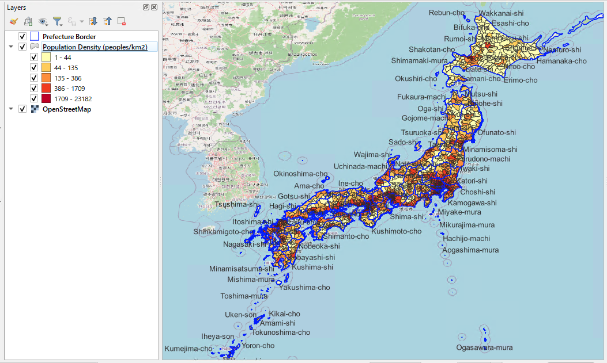
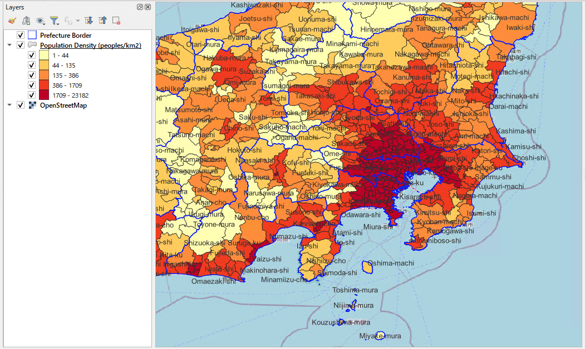
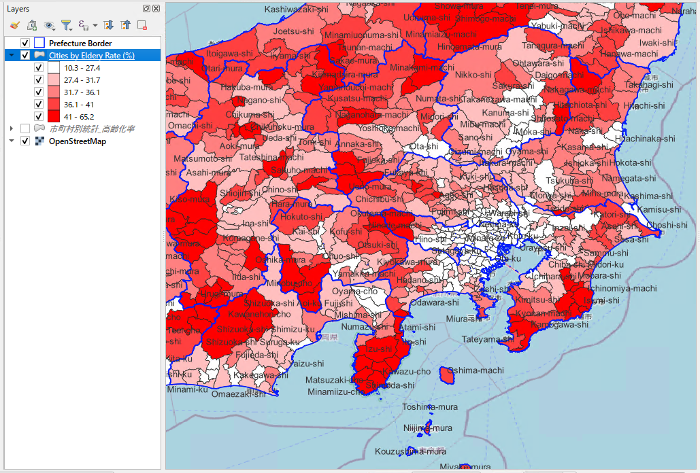

# SQL Templates

Production-ready PostGIS SQL templates for spatial analysis and location intelligence work in Japan. Each template uses a `WITH params AS (...)` block at the top — edit the parameters and run.

> **Data prerequisites:** Administrative boundary data in `admin_jp` schema + census data in `e_stat` schema are required. See [Quick Start](#quick-start) and [`census_jp_README.md`](../docs/census_jp_README.md) for setup instructions.

---

## Template Index

### 01_basic/ — Foundational spatial operations

| File | Purpose | Input | Output |
|------|---------|-------|--------|
| [01-01_find_city_from_point.sql](01_basic/01-01_find_city_from_point.sql) | Reverse-geocode a coordinate to municipality | lon, lat | municipality name, city code, area |
| [01-02_find_prefecture_from_city.sql](01_basic/01-02_find_prefecture_from_city.sql) | Look up prefecture and census stats by city code | city_code or pref_code | prefecture, region, population, elderly rate |
| [01-03_calc_distance_between_points.sql](01_basic/01-03_calc_distance_between_points.sql) | Straight-line distance between two coordinates | two lon/lat pairs | distance_km, distance_m |

### 02_analysis/ — Core spatial analysis

| File | Purpose | Input | Output |
|------|---------|-------|--------|
| [02-01_calc_trade_area_population.sql](02_analysis/02-01_calc_trade_area_population.sql) | Aggregate population within a radius | center lon/lat, radius (m) | population, elderly rate, density, distance — per municipality |
| [02-02_aggregate_customer_by_city.sql](02_analysis/02-02_aggregate_customer_by_city.sql) | Aggregate customer records by municipality | customer table (lon, lat) | customer count, penetration rate per municipality |
| [02-03_assign_delivery_area.sql](02_analysis/02-03_assign_delivery_area.sql) | Assign municipalities to nearest depot | depot list or single depot + radius | assigned depot, distance, census stats |
| [02-04_list_cities_within_radius.sql](02_analysis/02-04_list_cities_within_radius.sql) | List municipalities within a radius with bearing | center lon/lat, radius (m) | municipality list, distance, direction (N/NE/E…) |
| [02-05a_list_prefectures_along_route_simple.sql](02_analysis/02-05a_list_prefectures_along_route_simple.sql) | List prefectures along a route | waypoint coordinates | prefectures in travel order, route length per prefecture |
| [02-05b_list_cities_along_route_simple.sql](02_analysis/02-05b_list_cities_along_route_simple.sql) | List municipalities along a route | waypoint coordinates | municipalities in travel order, route length per municipality |
| [02-05c_list_cities_along_route_from_gps_log.sql](02_analysis/02-05c_list_cities_along_route_from_gps_log.sql) | Route analysis from GPS log table (postgres_fdw) | gps_log record_id | municipalities in travel order with trip metadata |
| [02-06_rank_cities_by_elderly_rate.sql](02_analysis/02-06_rank_cities_by_elderly_rate.sql) | Rank municipalities by elderly population rate | region / prefecture filter (optional) | ranked municipalities with demographic breakdown |

### 03_visualization/ — QGIS / map output queries

| File | Purpose | Output format |
|------|---------|---------------|
| [03-02_generate_choropleth_elderly_rate.sql](03_visualization/03-02_generate_choropleth_elderly_rate.sql) | Municipality polygons with demographic breakdown for QGIS choropleth — covers elderly rate, population density, and more | GeoJSON / PostGIS layer |
| 03-03_export_route_for_map.sql | Route geometry for map export | 🚧 in progress |
| 03-04_generate_heatmap_density.sql | Point density data for heatmap | 🚧 in progress |

### 06_advanced/ — Advanced spatial analysis

| File | Purpose |
|------|---------|
| 06-01_analyze_network_routing.sql | Road network routing | 🚧 in progress |
| 06-02_generate_voronoi_diagram.sql | Voronoi diagram generation | 🚧 in progress |
| 06-03_union_buffers.sql | Buffer union | 🚧 in progress |

### 99_snippets/ — Reusable SQL functions

| File | Purpose |
|------|---------|
| 99-01_distance_functions.sql | Distance calculation helpers | 🚧 in progress |
| 99-02_geometry_validators.sql | Geometry validation snippets | 🚧 in progress |
| 99-03_coordinate_transformers.sql | Coordinate system conversion | 🚧 in progress |

---

## Use Cases

### 🏪 Population & Trade Area Analysis

Determine catchment population within a given radius — the starting point for retail site selection and franchise planning.

```sql
-- 02-01_calc_trade_area_population.sql
WITH params AS (
    SELECT
        136.8816 AS center_lon,  -- longitude (e.g. Nagoya Station)
        35.1706  AS center_lat,  -- latitude
        30000    AS radius_m     -- radius in metres (30 km)
)
SELECT
    m.full_name,
    m.city_name_en,
    m.population,
    m.elderly_rate,
    m.pop_density,
    m.area_km2,
    ROUND(
        ST_Distance(
            m.geom::geography,
            ST_SetSRID(ST_MakePoint(p.center_lon, p.center_lat), 4326)::geography
        )::numeric / 1000,
    2) AS distance_km
FROM e_stat.v_census_municipality m, params p
WHERE ST_DWithin(
    m.geom::geography,
    ST_SetSRID(ST_MakePoint(p.center_lon, p.center_lat), 4326)::geography,
    p.radius_m
)
ORDER BY distance_km;
```

> **What you get:** municipality name, population, elderly rate, density, area, and distance from center — sorted by proximity.


*Population density by municipality (nationwide) — generated with 03-02_generate_choropleth_elderly_rate.sql + QGIS (styled by `pop_density`)*


*Zoomed view (Kanto / Chubu region)*

---

### 👴 Demographic & Aging Analysis

Rank municipalities by elderly population rate — useful for healthcare facility planning and senior services market research.

```sql
-- 02-06_rank_cities_by_elderly_rate.sql (excerpt)
WITH params AS (
    SELECT
        NULL::text AS target_region,   -- e.g. '東北' — NULL for nationwide
        NULL::text AS target_pref,     -- e.g. '秋田県' — NULL for all
        5000       AS min_population,
        20         AS limit_count
)
SELECT
    m.full_name,
    m.city_name_en,
    m.pref_name,
    m.region,
    m.population,
    m.elderly_rate,
    m.age_avg,
    m.pop_density
FROM e_stat.v_census_municipality m
CROSS JOIN params p
WHERE m.population IS NOT NULL
  AND m.population >= p.min_population
  AND (p.target_region IS NULL OR m.region = p.target_region)
  AND (p.target_pref   IS NULL OR m.pref_name = p.target_pref)
ORDER BY m.elderly_rate DESC
LIMIT (SELECT limit_count FROM params);
```

> **Census design note:** Population and employment data for 2015 and 2020 are stored in a single normalized table (`e_stat.census_population`) keyed by `survey_year`. The unified view `e_stat.v_census_municipality` always references the latest available year; year-specific views (`_2015`, `_2020`) allow explicit cross-year comparison.


*Elderly rate by municipality (nationwide) — generated with 03-02_generate_choropleth_elderly_rate.sql + QGIS*


*Zoomed view (Kanto / Chubu region)*

---

### 🚚 Delivery Area Assignment & Route Analysis

Assign municipalities to delivery depots, and identify which prefectures or municipalities a route passes through.

```sql
-- 02-05a_list_prefectures_along_route_simple.sql (excerpt)
WITH route_points AS (
    SELECT * FROM (VALUES
        (1, 139.7673, 35.6809),  -- Tokyo Station
        (2, 136.8816, 35.1706),  -- Nagoya Station
        (3, 135.4952, 34.7020)   -- Osaka Station
    ) AS t(seq, lon, lat)
),
route_line AS (
    SELECT ST_MakeLine(
        ST_SetSRID(ST_MakePoint(lon, lat), 4326) ORDER BY seq
    ) AS geom
    FROM route_points
)
SELECT
    p.pref_name,
    ROUND((ST_Length(ST_Intersection(p.geom, r.geom)::geography) / 1000)::numeric, 2) AS route_length_in_pref_km,
    ROUND((ST_Length(ST_LineSubstring(r.geom, 0,
        ST_LineLocatePoint(r.geom, ST_ClosestPoint(p.geom, ST_StartPoint(r.geom)))
    )::geography) / 1000)::numeric, 2) AS distance_from_start_km
FROM admin_jp.prefectures p
CROSS JOIN route_line r
WHERE ST_Intersects(p.geom, r.geom)
ORDER BY distance_from_start_km;
```

A GPS log variant (`02-05c`) reads directly from an external database via `postgres_fdw`, enabling route analysis from vehicle tracking systems without exporting data to CSV.

---

### 📦 Customer Distribution & Territory Analysis

Aggregate customer records by municipality to support sales territory design and marketing area reporting.

```sql
-- 02-02_aggregate_customer_by_city.sql — Query B (excerpt)
WITH valid_customers AS (
    SELECT customer_id, longitude, latitude
    FROM work.customers
    WHERE customer_id IS NOT NULL
      AND longitude BETWEEN 122 AND 154
      AND latitude  BETWEEN 20  AND 46
)
SELECT
    m.pref_name,
    m.full_name,
    m.city_name_en,
    COUNT(c.customer_id)                                        AS customer_count,
    m.population,
    ROUND(COUNT(c.customer_id)::numeric / NULLIF(m.population, 0) * 10000, 2) AS customers_per_10k_population
FROM e_stat.v_census_municipality m
JOIN valid_customers c
    ON ST_Contains(m.geom, ST_SetSRID(ST_MakePoint(c.longitude, c.latitude), 4326))
GROUP BY m.pref_name, m.full_name, m.city_name_en, m.population
ORDER BY customer_count DESC;
```

> The template includes a data quality check (Query A) that flags missing IDs, out-of-range coordinates, and duplicate records before aggregation.

---

## Quick Start

### Prerequisites

- PostgreSQL 12+ with PostGIS 3.0+ enabled
- Administrative boundary data loaded into `admin_jp` schema
- Census data loaded into `e_stat` schema

### 1. Enable PostGIS

```sql
CREATE EXTENSION IF NOT EXISTS postgis;
```

### 2. Load boundary data

Download administrative boundary files (行政区域) from [国土数値情報 / NLNI](https://nlftp.mlit.go.jp/ksj/) in GeoJSON or Shapefile format. Load into the `admin_jp` schema using `ogr2ogr` or QGIS DB Manager.

### 3. Load census data

See [`census_jp_README.md`](../docs/census_jp_README.md) for data sources, schema design, and step-by-step ingestion instructions. Census data is sourced from [e-Stat](https://www.e-stat.go.jp/).

### 4. Run your first query

Open `01_basic/01-01_find_city_from_point.sql`, edit the coordinate in the `params` block, and run:

```bash
psql -d your_database -f 01_basic/01-01_find_city_from_point.sql
```

Or try the trade area analysis template with Nagoya Station as the center point:

```bash
psql -d your_database -f 02_analysis/02-01_calc_trade_area_population.sql
```

---

## Data Sources

| Dataset | Provider | License | Notes |
|---------|----------|---------|-------|
| Administrative boundaries (市区町村・都道府県) | [国土数値情報, MLIT](https://nlftp.mlit.go.jp/ksj/) | Free for commercial use with attribution | 2023 edition, 1,917 municipalities |
| Census — population (国勢調査 第１面) | [e-Stat, Statistics Bureau of Japan](https://www.e-stat.go.jp/) | Free for commercial use with attribution | 2015 & 2020 |
| Census — employment (国勢調査 第２面) | [e-Stat, Statistics Bureau of Japan](https://www.e-stat.go.jp/) | Free for commercial use with attribution | 2020 (industry × occupation breakdown) |
| Road network | [OpenStreetMap](https://www.openstreetmap.org/) | ODbL — attribution required | Major roads materialized view |

For full data source documentation including download URLs, file structure, and schema design decisions, see [`census_jp_README.md`](../docs/census_jp_README.md).
